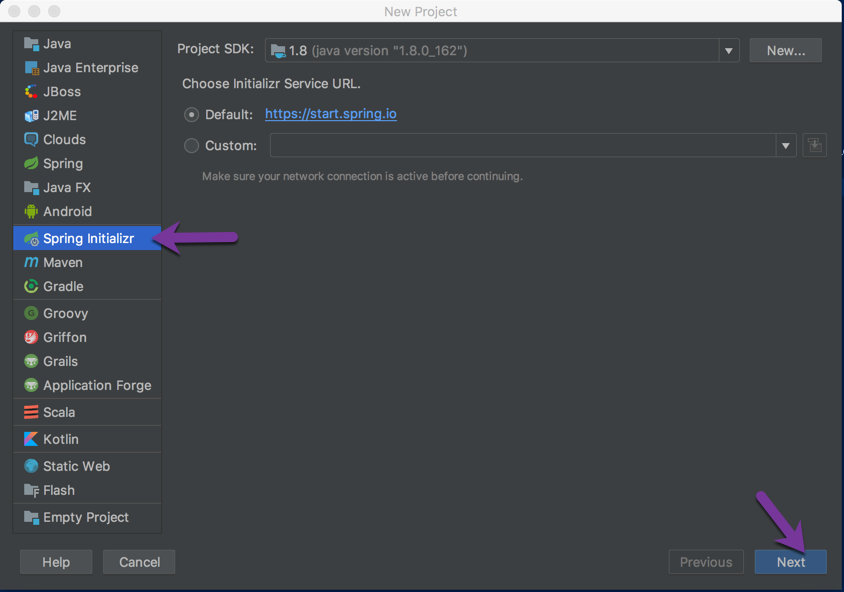

# Build core platform components
In this lab we will build core platform compoents to be used when building Storelocator service

## Eureka server 

1. Create a new project in IntelliJ and select spring initializer and click next as shown in diagram below



2. Fill in the project metadata and click next as shown in diagram below.


3. For dependencies select Eureka Server 


5. Select the output directory where project files should be created and click finish as shown below


6. Open pom.xml file and include Eureka client as dependency

```xml
<dependency>
    <groupId>org.springframework.cloud</groupId>
    <artifactId>spring-cloud-starter-netflix-eureka-client</artifactId>
</dependency>
```

7. Add "@EnableEurekaServer" annotation to SpringBoot application bootstrap class

8. Rename application.properties file under resources directory to application.yaml format. For this tutorial we will stick with using yaml as file format for configuration options

9. Configure Eureka server.

```yaml
server:
  port: 8761

eureka:
  client:
    register-with-eureka: false
    fetch-registry: false
    service-url:
      defaultZone: http://localhost:8761/eureka/


logging:
  level:
    com.netflix.eureka: off
    com.netflix.discovery: off

---
spring:
  profiles: docker
eureka:
  client:
    service-url:
      defaultZone: http://eurekaserver:8761/eureka/

---
spring:
  profiles: cloud
eureka:
  client:
    service-url:
      defaultZone: ${REGISTRY_URL}
```

10. Dockerize Eureka server application

    a. Create a Dockerfile under root directory of Eureka server project and add snippet below to it.

```
FROM maven:3.5-jdk-8 as builder

WORKDIR /projects/java/eurekaserver

COPY . .

RUN mvn clean install -DskipTests

FROM openjdk:alpine

VOLUME /tmp

COPY entrypoint.sh /

COPY --from=builder /projects/java/eurekaserver/target/*.jar app.jar

RUN apk update && apk upgrade && apk add --no-cache bash wget && rm -rf /var/cache/apk/* \
    && bash -c 'touch /app.jar' \
    && chmod 700 /entrypoint.sh

ENTRYPOINT ["./entrypoint.sh"]

CMD [ "start" ]
```

    b. Create an entrypoint.sh file and add snippet below to it.

```
#!/usr/bin/env bash

CMD=$1
echo "Command :" $CMD

JAVA_OPTS="$JAVA_OPTS -Djava.net.preferIPv4Stack=true -Djava.net.preferIPv4Addresses -Duser.timezone=America/Los_Angeles -Dspring.profiles.active=default,$PROFILE -Djava.security.egd=file:/dev/./urandom"

echo $JAVA_OPTS

case "$CMD" in
    "start")
        echo "Starting SpringBoot application"
        exec java $JAVA_OPTS -jar /app.jar
    ;;

    * )
    # custom command
    echo "custom command"
    exec $CMD ${@:2}
    ;;
esac

```
    c. Create a file "clean.sh" under root directory for app to cleanup running containers and include snippet below. In my example its "storelocator" and clean.sh script is created under that

```
#!/usr/bin/env bash

PID=`docker ps | grep eurekaserver | awk '{print $1}'`
echo "Stopping container $PID"
docker stop $PID

echo "Removing container $PID"
docker rm $PID
```

    c. Create a Makefile add following snippet below

```
TAG?=latest

build:
	docker build -t appsbyram/eurekaserver:$(TAG) .

push:
	docker push appsbyram/eurekaserver:$(TAG)

clean:
	./clean.sh

```

11. Building the eureka server application

Run command below to build the eureka server application.

```
make build
```

12. Push the eureka server application docker image to dockerhub

Run command below to push the docker image to dockerhub

```
makek push
```

13. Cleaning up the running container

Run the command below to cleanup container running locally.

```
make clean
```

## Spring Cloud Configuration Server

### Create a git repository to be used to store configuration files

1. Login to github and create a new repository and name it "config"

2. Clone the repository to your local development machine

At this point you are all set to build a configuration server backed by a git repository that can be used to provide configuration information to individual microservices that needs them.

3. Create an ssh key
Create a brand new ssh key and use it from config server to talk to the backing git repository where configuration yaml files are stored.


### Create the config server
In this section we will be creating a configuration server that is backed by a git repository where configuration for microservices will be stored and used within the microservices. 

1. Create a new project in IntelliJ and select spring initializer and click next as shown in diagram below


2. Fill in the project metadata and click next as shown below


3. Select Spring Cloud Config, Eureka Discovery and Actuator as dependencies as shown below and click on next.


4. Rename application.properties file under resources to application.yml

5. Generate a new ssh key that can be used by config server to authenticate with github. If you are new to this refer to this [article](https://help.github.com/articles/generating-a-new-ssh-key-and-adding-it-to-the-ssh-agent/). Please be sure to leave the passphrase empty and save the key into a file named oscon_2018


6. Run the command below to copy the private key and add it to private-key section of application.yaml

```
pbcopy < /Users/rgopina/oscon_2018

```

7. Add the newly generated key to your Github account. If you are new to this please refer this [article](https://help.github.com/articles/adding-a-new-ssh-key-to-your-github-account/)\

8. Configure the config server. Add the snippet below into application.yaml file under resources. Replace the git URL to match url for the config repo

```yaml
server:
  port: 8888
  error:
    include-stacktrace: always
    include-exception: true
logging:
  level:
    com.netflix.discovery: 'OFF'
    org.springframework.cloud: 'INFO'

spring:
  cloud:
    config:
      server:
        git:
          uri: {add your git ssh uri for config repo here}
          ignore-local-ssh-settings: true
          private-key: |
            {add your private key here}
      discovery:
        enabled: true
        service-id: configserver
  application:
    name: configserver

eureka:
  client:
    register-with-eureka: true
    fetch-registry: true
    registry-fetch-interval-seconds: 30
    service-url:
      defaultZone: http://localhost:8761/eureka/

---
spring:
  profiles: docker
eureka:
  client:
    service-url:
      defaultZone: http://eurekaserver:8761/eureka/

---
spring:
  profiles: cloud
eureka:
  client:
    service-url:
      defaultZone: ${REGISTRY_URL}

```


6. Add following annotations to "ConfigserverApplication" Springboot startup class as shown below.

```

@Configuration
@EnableAutoConfiguration
@EnableDiscoveryClient
@EnableConfigServer
@SpringBootApplication
public class ConfigserverApplication {

    public static void main(String[] args) {
        SpringApplication.run(ConfigserverApplication.class, args);
    }
}

```
7. Add Dockerfile to run config server in a container and add contents below to it

```
FROM maven:3.5-jdk-8 as builder

WORKDIR /projects/java/configserver

COPY . .

RUN mvn clean install -DskipTests

FROM openjdk:alpine

VOLUME /tmp

COPY entrypoint.sh /

COPY --from=builder /projects/java/configserver/target/*.jar app.jar

RUN apk update && apk upgrade && apk add --no-cache bash wget && rm -rf /var/cache/apk/* \
    && bash -c 'touch /app.jar' \
    && chmod 700 /entrypoint.sh

ENTRYPOINT ["./entrypoint.sh"]

CMD [ "start" ]
```

8. Add "entrypoint.sh" script and paste contents below to it.

```

#!/usr/bin/env bash

CMD=$1
echo "Command :" $CMD

JAVA_OPTS="$JAVA_OPTS -Djava.net.preferIPv4Stack=true -Djava.net.preferIPv4Addresses -Duser.timezone=America/Los_Angeles -Dspring.profiles.active=default,$PROFILE -Djava.security.egd=file:/dev/./urandom"

echo $JAVA_OPTS

case "$CMD" in
    "start")
        echo "Starting SpringBoot application"
        exec java $JAVA_OPTS -jar /app.jar
    ;;

    * )
    # custom command
    echo "custom command"
    exec $CMD ${@:2}
    ;;
esac

```

9. Add Makefile and paste contents below to it.

```

TAG?=latest

build:
	docker build -t appsbyram/configserver:$(TAG) .

push:
	docker push appsbyram/configserver:$(TAG)

clean:
	./clean.sh

```

10. Add clean.sh script and paste contents below to it. This script is to cleanup config server container.

```
PID=`docker ps | grep configserver | awk '{print $1}'`
echo "Stopping container $PID"
docker stop $PID

echo "Removing container $PID"
docker rm $PID
```

11. Test Building Of Configserver container locally by running command below

```

make build

```

12. Test pushing the configserver container to dockerhub by running command below

```
make push
```

13. Test cleaning up the running configserver container by running command below

```
make clean
```

## Create an edge service application using Netflix Zuul
In this section we will create an edge service application which will act as a front door for all the requests for microservices as well as UI assets that need
to be served from backend store.

1. Create a new project in IntelliJ and select spring initializer and click next as shown in diagram below


2. Fill in the project metadata and click next as shown below


3. Select Zuul from cloud routing, Config Client from Cloud Config and Eureka Discovery from Cloud Discovery and click next as shown in screen capture below


4. Update pom.xml and add additional dependencies listed below

```
 <dependency>
    <groupId>org.springframework.cloud</groupId>
    <artifactId>spring-cloud-starter-netflix-hystrix</artifactId>
    <version>2.0.0.RELEASE</version>
</dependency>
<dependency>
    <groupId>org.springframework.cloud</groupId>
    <artifactId>spring-cloud-starter-netflix-hystrix-dashboard</artifactId>
</dependency>

```

5. Open the "GatewayApplication" class and add following annotations
    
    - "@EnableZuulProxy"
    - "@EnableDiscoveryClient"
    - "@EnableHystrix"
    - "@EnableHystrixDashboard"

5. Rename application.properties file under resources folder to "bootstrap.yaml" and paste contents below into it.

```
spring:
  application:
    name: gateway
  cloud:
    config:
      enabled: true
      failFast: true

server:
  port: 80

debug: true

logging:
  level:
    org.springframework.web: 'DEBUG'

eureka:
  client:
    fetch-registry: true
    register-with-eureka: true
    registry-fetch-interval-seconds: 30
    service-url:
      defaultZone: http://localhost:8761/eureka/

---
spring:
  profiles: docker
  cloud:
    config:
      uri: http://configserver:8888
eureka:
  client:
    service-url:
      defaultZone: http://eurekaserver:8761/eureka/

---
spring:
  profiles: cloud
  cloud:
    config:
      uri: ${CONFIGSERVER_URL}
eureka:
  client:
    service-url:
      defaultZone: ${REGISTRY_URL}
```

6. Configure Zuul test routes
In this section we will setup the ground work for adding http routes for our edge service application.

Open VSCode or any editor of your choice and open the folder/directory where you cloned the config repository. This is the repository we created in steps above that we used as backing repository for our config server.

Add a new file and name it gateway.yaml and paste contents below to it.

```
zuul:
  routes:
    tester:
      path: /tester/**
      serviceId: tester
    ms:
      path: /ms/**
      url: http://www.microsoft.com

management:
  endpoints:
    web:
      exposure:
        include: *

hystrix:
  command:
    default:
      execution:
        isolation:
          thread:
            timeoutInMilliseconds: 1000 #1sec
```

7. Add Dockerfile to the root of the project and paste contents below to it.

```
FROM maven:3.5-jdk-8 as builder

WORKDIR /projects/java/gateway

COPY . .

RUN mvn clean install -DskipTests

FROM openjdk:alpine

VOLUME /tmp

COPY entrypoint.sh /

COPY --from=builder /projects/java/gateway/target/*.jar app.jar

RUN apk update && apk upgrade && apk add --no-cache bash wget && rm -rf /var/cache/apk/* \
    && bash -c 'touch /app.jar' \
    && chmod 700 /entrypoint.sh

ENTRYPOINT ["./entrypoint.sh"]

CMD [ "start" ]
```

8. Add entrypoint.sh script to the root of the project and paste contents below to it.

```
#!/usr/bin/env bash

CMD=$1
echo "Command :" $CMD

JAVA_OPTS="$JAVA_OPTS -Djava.net.preferIPv4Stack=true -Djava.net.preferIPv4Addresses -Duser.timezone=America/Los_Angeles -Dspring.profiles.active=default,$PROFILE -Djava.security.egd=file:/dev/./urandom"

echo $JAVA_OPTS

case "$CMD" in
    "start")
        echo "Starting SpringBoot application"
        exec java $JAVA_OPTS -jar /app.jar
    ;;

    * )
    # custom command
    echo "custom command"
    exec $CMD ${@:2}
    ;;
esac

```

9. Add Makefile to root of the project and paste contents below

```
TAG?=latest

build:
	docker build -t appsbyram/gateway:$(TAG) .

push:
	docker push appsbyram/gateway:$(TAG)

```

10. Test to edge service is routing to backend endpoints
Open a browser and type http://localhost/tester You should see a response 800 printed which is from the tester microservice that simply returns the interval from config. If you want to play around you can go ahead and add more routes to your config file and commit the config file to git repo and restart the gateway application.


